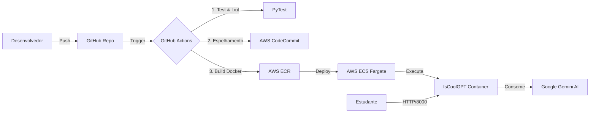

# ☁️ IsCoolGPT – Assistente Inteligente de Estudos em Cloud

O **IsCoolGPT** é um assistente educacional inteligente projetado para auxiliar estudantes na disciplina de **Cloud Computing**.  
O projeto adota uma arquitetura moderna baseada em **microsserviços**, **containerização** e um **pipeline robusto de DevOps na AWS**.

---

## 🧠 Visão Geral

- 🎯 **Objetivo**: apoiar estudantes com respostas rápidas e contextualizadas sobre Cloud Computing.  
- 🏗️ **Back-end**: FastAPI (Python).  
- 🤖 **IA**: Google Gemini (2.5 Flash).  
- ☁️ **Infraestrutura**: AWS ECS Fargate + ECR + CodeCommit.  
- 🔁 **CI/CD**: GitHub Actions com deploy automatizado.

---

## 🏗️ Arquitetura e Fluxo de DevOps

O projeto segue o **Princípio do Menor Privilégio (Least Privilege)** e utiliza um modelo de **Infraestrutura como Código indireto**, por meio de definições de task do ECS.

---
## 🧩 Componentes da Infraestrutura

- GitHub: Repositório principal para versionamento e Pull Requests.
- GitHub Actions: Orquestrador de CI/CD (testes, build e deploy).
- AWS CodeCommit: Espelho do repositório para compliance e backup dentro da AWS.
- AWS ECR: Registro privado para armazenamento seguro das imagens Docker.
- AWS ECS (Fargate): Orquestrador Serverless de containers com alta disponibilidade e escalabilidade.

- Google Gemini 2.5 Flash: Motor de IA generativa para respostas rápidas e precisas.
---
## 🚀 Como Rodar Localmente
### ✅ Pré-requisitos

- Docker instalado
- Python 3.10+ (caso queira rodar sem Docker)
- Chave de API do Google AI Studio (GOOGLE_API_KEY)

### 1️⃣ Clonar o repositório
git clone https://github.com/joaohlafeta/isCoolGPT.git
cd isCoolGPT

### 2️⃣ Configurar variáveis de ambiente

Crie um arquivo .env na raiz do projeto (não faça commit deste arquivo):

GOOGLE_API_KEY=sua_chave_aqui

### 3️⃣ Executar via Docker (Recomendado)
docker build -t iscoolgpt .
docker run -p 8000:8000 --env-file .env iscoolgpt

### 4️⃣ Acessar a aplicação

💬 Chat Web:
http://localhost:8000

### 📘 Documentação da API (Swagger UI):
http://localhost:8000/docs

---
## 📖 API – Documentação (Swagger/OpenAPI)

O projeto utiliza FastAPI, que gera automaticamente documentação interativa seguindo o padrão OpenAPI.

## 🔌 Endpoints principais
- Método	Endpoint	Descrição
- GET	/	Interface Web do chat (frontend).
- GET	/docs	Swagger UI – documentação interativa.
- POST	/ask	Endpoint principal: recebe a pergunta e retorna a resposta.
📦 Exemplo de payload (POST /ask)
{
  "question": "O que é um Load Balancer?",
  "subject": "Cloud Computing"

}

---

## 🛡️ Segurança e Decisões Técnicas
### 🔐 IAM & Princípio do Menor Privilégio

- O usuário de CI/CD (github-actions) possui permissão PowerUser apenas no CodeCommit, reduzindo o risco de deleção acidental de repositórios.

- A Task Role/Execution Role do ECS (ecsTaskExecutionRole) possui acesso estritamente necessário:

- Pull de imagens no ECR

- Logs no CloudWatch

---

## 🌐 Networking

- Security Group liberando apenas a porta TCP/8000 para acesso HTTP.

- SSH (Porta 22) bloqueada por padrão (arquitetura imutável, sem acesso direto à máquina).

---

## 🔑 Gestão de Segredos

- Credenciais da AWS injetadas via GitHub Secrets no pipeline de CI/CD.

- GOOGLE_API_KEY configurada como variável de ambiente na Task Definition do ECS, sem exposição em código-fonte.
